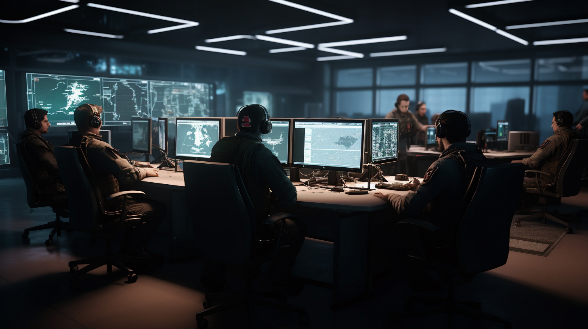

# AegisNet

---

<!--
Date: 07-08-2023
Time: 13:21
Auth: Kylo Parisher (cywf)
Note: for reseach purposes only
-->

## Overview

AegisNet is an advanced defense product solution that integrates several cutting-edge technologies. Our goal is to provide a comprehensive system that combines situational awareness, advanced detection surveillance, autonomous drone software, and more into a unified platform.

## Technologies

AegisNet incorporates the following technologies:

- **FreeTAKServer**: A server that provides situational awareness, compatible with TAK clients.
- **Heimdall**: An advanced detection surveillance system that uses AI and ML for facial recognition and behavior analysis.
- **Sentinel Project**: A security system designed to protect critical infrastructure from cyber threats.
- **Prometheus**: An open-source autonomous drone software platform.
- **RadareEye**: A tool that scans nearby devices and executes a command on its own system when the target device comes into range.
- **Traffic**: A toolbox for processing and analyzing air traffic data.

## Team Structure

Our team is composed of:

- **Developers (DV)**: Maintain the code base.
- **Engineers (EG)**: Handle the architecture, strategy, and logic.
- **Tactical Units (TU)**: Simulated tactical units utilizing what we make and testing it out in the field.
- **Command (CO)**: Comprises of HR, admin personnel, as well as Command and handle operations.
- **Contributors (CT)**: Our future contributors.
- **Quality Assurance (QA)**: Responsible for testing and quality assurance.
- **Incident Response (IR)**: Handles incident response.

## Project Timeline

- **1 Month**: Organizational structure and project management tools in place.
- **3 Months**: Development environment finalized to match our desired production environment.
- **6 Months**: Project deployed in the field / production environments.

## License

All rights reserved until license terms are defined.
