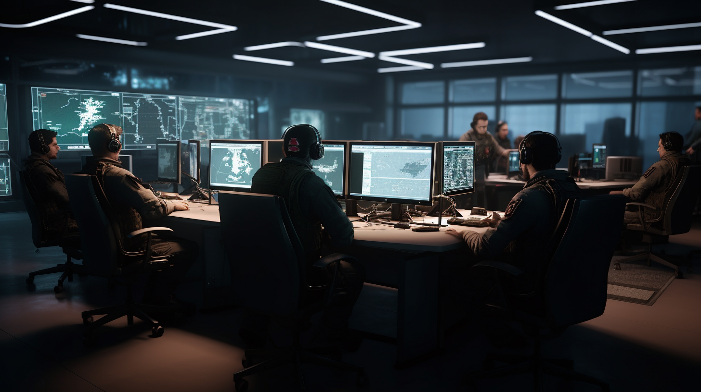

# AegisNet

---

<!--
Date: 07-08-2023
Time: 13:21
Auth: Kylo Parisher (cywf)
Note: for research purposes only
-->



## Overview

AegisNet is an advanced defense product solution that integrates several cutting-edge technologies. Our goal is to provide a comprehensive system that combines situational awareness, advanced detection surveillance, autonomous drone software, and more into a unified platform.

## 🚀 Quick Start

### Local Development

```bash
# Clone the repository
git clone https://github.com/cywf/AegisNet.git
cd AegisNet

# Run setup script
./scripts/setup-local.sh

# Or use Make
make dev
```

### Cloud Deployment

```bash
# Deploy infrastructure
make deploy

# Or manually
./scripts/deploy-cloud.sh
```

See the [Deployment Guide](docs/DEPLOYMENT.md) for detailed instructions.

## 📋 Documentation

- **[Deployment Guide](docs/DEPLOYMENT.md)** - Complete deployment instructions
- **[Architecture](docs/ARCHITECTURE.md)** - System architecture and design
- **[Terraform Guide](infra/terraform/README.md)** - Infrastructure as Code
- **[Kubernetes Guide](infra/kubernetes/README.md)** - Container orchestration
- **[Roadmap](docs/roadmap.md)** - Project timeline and milestones

## 🛠️ Technologies

AegisNet incorporates the following technologies:

- **FreeTAKServer**: A server that provides situational awareness, compatible with TAK clients.
- **Heimdall**: An advanced detection surveillance system that uses AI and ML for facial recognition and behavior analysis.
- **Sentinel Project**: A security system designed to protect critical infrastructure from cyber threats.
- **Prometheus**: An open-source autonomous drone software platform.
- **RadareEye**: A tool that scans nearby devices and executes a command on its own system when the target device comes into range.
- **Traffic**: A toolbox for processing and analyzing air traffic data.

## 🏗️ Infrastructure

AegisNet supports multiple deployment models:

### Local Development
- **Docker & Docker Compose**: Containerized local environment
- **Quick setup**: One-command deployment

### Cloud Deployment
- **AWS**: ECS, EKS with Terraform modules
- **Azure**: AKS with managed services
- **Google Cloud**: GKE with cloud-native integration
- **DigitalOcean**: Kubernetes clusters
- **Multi-cloud**: Flexible provider selection

### Autonomous/Edge Deployment
- **K3s**: Lightweight Kubernetes for edge
- **Offline capable**: Air-gapped deployment support
- **Resource efficient**: Optimized for constrained environments

## 🔧 Features

- ✅ **Docker Support**: Fully containerized architecture
- ✅ **Kubernetes Ready**: Production-grade orchestration
- ✅ **Infrastructure as Code**: Terraform for all major cloud providers
- ✅ **CI/CD Pipelines**: GitHub Actions for automated testing and deployment
- ✅ **Security Scanning**: Automated vulnerability detection
- ✅ **Auto-scaling**: Horizontal pod autoscaling
- ✅ **Monitoring**: Prometheus & Grafana integration
- ✅ **Multi-environment**: Dev, staging, and production configs

## 📦 Project Structure

```
AegisNet/
├── .github/workflows/    # CI/CD pipelines
├── docs/                 # Documentation
├── infra/               # Infrastructure as Code
│   ├── kubernetes/      # Kubernetes manifests
│   └── terraform/       # Terraform configurations
├── scripts/             # Deployment and utility scripts
├── Dockerfile           # Container definition
├── docker-compose.yml   # Local development setup
├── Makefile            # Common operations
└── README.md           # This file
```

## 🎯 Common Commands

```bash
# Local development
make dev          # Start local development environment
make logs         # View logs from all services
make stop         # Stop all services
make clean        # Clean up containers and images

# Infrastructure
make tf-plan      # Preview Terraform changes
make tf-apply     # Apply Terraform changes

# Kubernetes
make k8s-deploy   # Deploy to Kubernetes
make k8s-status   # Check deployment status
make k8s-logs     # View pod logs

# Validation
make validate     # Validate all configurations
make security-scan # Run security scans
```

## 👥 Team Structure

Our team is composed of:

- **Developers (DV)**: Maintain the code base.
- **Engineers (EG)**: Handle the architecture, strategy, and logic.
- **Tactical Units (TU)**: Simulated tactical units utilizing what we make and testing it out in the field.
- **Command (CO)**: Comprises of HR, admin personnel, as well as Command and handle operations.
- **Contributors (CT)**: Our future contributors.
- **Quality Assurance (QA)**: Responsible for testing and quality assurance.
- **Incident Response (IR)**: Handles incident response.

## 📅 Project Timeline

- **1 Month**: Organizational structure and project management tools in place.
- **3 Months**: Development environment finalized to match our desired production environment.
- **6 Months**: Project deployed in the field / production environments.

See [roadmap.md](docs/roadmap.md) for detailed milestones.

## 🔒 Security

- **Secrets Management**: Environment-based configuration
- **Container Scanning**: Automated vulnerability detection
- **Secret Detection**: Pre-commit hooks for sensitive data
- **Security Scanning**: Trivy and TruffleHog integration
- **Network Security**: Multi-layer defense approach

## 🤝 Contributing

We welcome contributions! Please:

1. Fork the repository
2. Create a feature branch
3. Make your changes
4. Run tests and validation: `make validate`
5. Submit a pull request

## 📝 License

All rights reserved until license terms are defined.

## 🆘 Support

- **Issues**: [GitHub Issues](https://github.com/cywf/AegisNet/issues)
- **Documentation**: Check the `docs/` directory
- **Discussions**: [GitHub Discussions](https://github.com/cywf/AegisNet/discussions)

## 🙏 Acknowledgments

Built with modern DevOps practices and cloud-native technologies for a secure, scalable, and autonomous defense platform.

